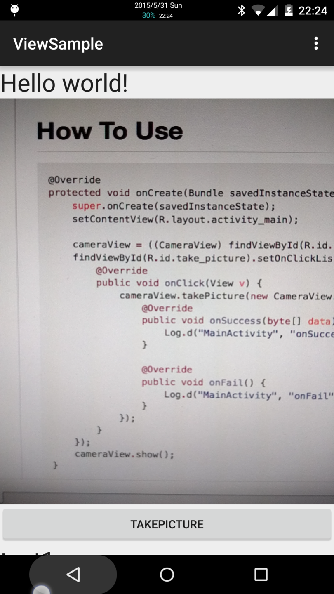

# Custom Camera View Sample

`SurfaceView`と`TextureView`を使い分けるCameraのCustomView



# build.gradle

```groovy
repositories {
    maven {
        url "https://raw.githubusercontent.com/petitviolet/MultiCamera/master/repository/"
    }
}

dependencies {
    compile "net.petitviolet:multicamera:0.1.0"
}
```

# How To Use

```java
@Override
protected void onCreate(Bundle savedInstanceState) {
    super.onCreate(savedInstanceState);
    setContentView(R.layout.activity_main);

    cameraView = ((CameraView) findViewById(R.id.camera)).initView();
    findViewById(R.id.take_picture).setOnClickListener(new View.OnClickListener() {
        @Override
        public void onClick(View v) {
            cameraView.takePicture(new CameraView.TakePictureCallback() {
                @Override
                public void onSuccess(byte[] data) {
                    Log.d("MainActivity", "onSuccess");
                }

                @Override
                public void onFail() {
                    Log.d("MainActivity", "onFail");
                }
            });
        }
    });
    cameraView.show();
}
```

# License

[MIT License](http://petitviolet.mit-license.org/)
